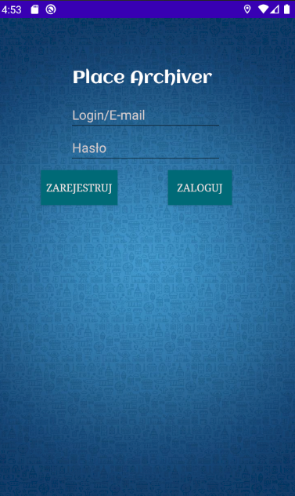
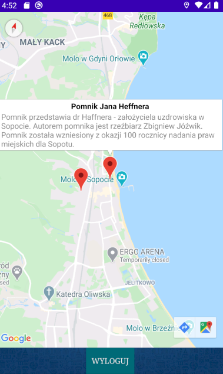
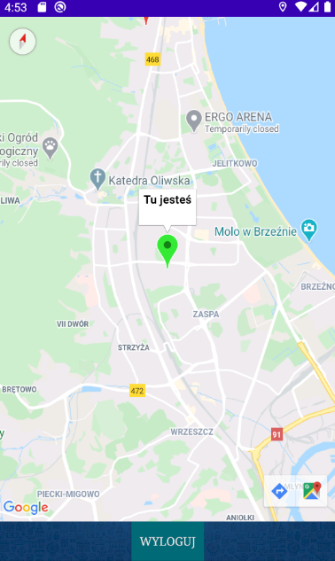
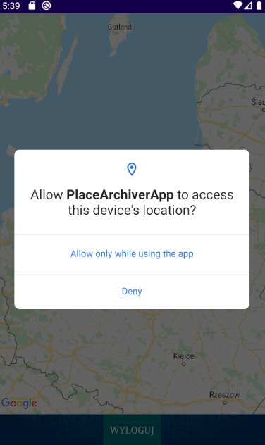

# Place Archiver 0.5
## Agenda
* [Description](#description)
* [Technologies](#technologies)
* [Current features](#current-features)
* [Run application](#run-application)
* [Planned features](#planned-features)
* [Contact](#contact)
## Description
Place Archiver is an application for tourist and history lovers, who wants to learn something interesting about places they're passing. It shows nearby historical places and shows it on the map with short description of the place and its genesis. Application is easy for use for everyone. Project is made by student for examinate his skills in Android Cloud Computing topic. 
#### Login & register screen
    
App uses Firebase for authentication and data storing, so it's not aggravating devices. 
Until there is not hundrets of places it won't be filted by range and user location. If it be done, author is planning to use GeoFire library.
#### Functional views
    
To run the app is required to allow GPS and Internet permissions  
     
## Current features
* Authentication via Firebase
* Possibility to learn history of places that You're passing
* User does not have to search for information about interesting historical places

## Technologies
Project is created with:
* Java SDK 11.0.6
* Firebase console for database and authentication  
IDE: 
* Android Studio 3.6.1

	
## Run application
To run this project, download the repository and run the app with Your IDE. Place Archiver will probably be published on Play Store.

## Planned features
 ### (Edit 2020/05/01)
* Images for places snippets
* Multilanguage
* Layout experience improvment
* Places added by users
* Admin panel for easy managment of the app
* New drawables
* Places comments and ratings
* Navigation to places inside application
* IOS version 
## Contact
darreur@gmail.com
